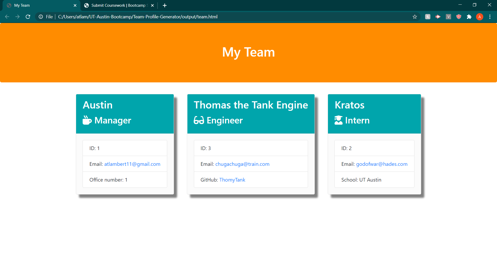

# Team-Profile-Generator

## Description

In this project I created a CLI application that generates a teams information based off question propmts given to the user and how they answer. The information gathered includes name, id number, email, and other information depending on the team members role in the group. It was created in order to make managing a teams information more reasonable.

As shown above the application formatted the gathered information into an HTML page. The three roles of manager, intern, and engineer also had unique instances of data. Managers were asked for their office number in the prompt, while interns were asked for their shool name, and lastly engineers were asked for their github account information.

## Application Functionality

THe video below shows how the application functions in the command line

Video Link: https://drive.google.com/file/d/1DnTmvsnhO6o0jbyXIvb9auB03cuZR5xJ/view
